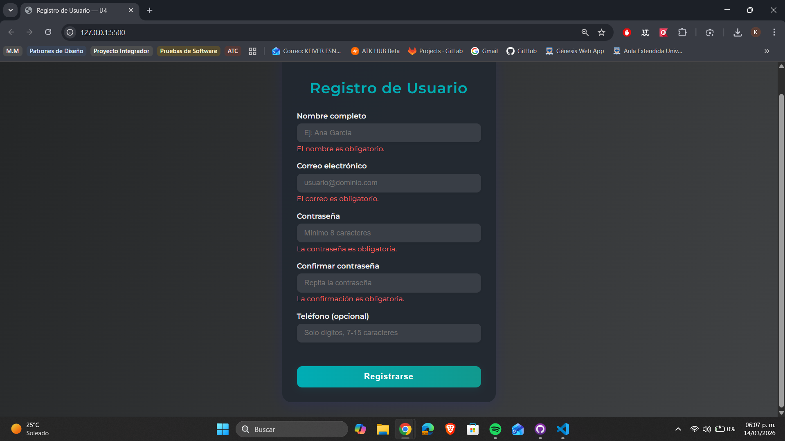
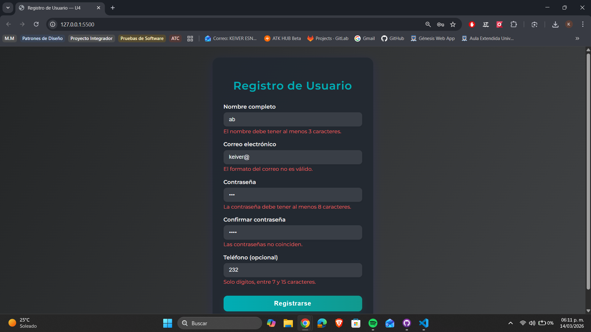
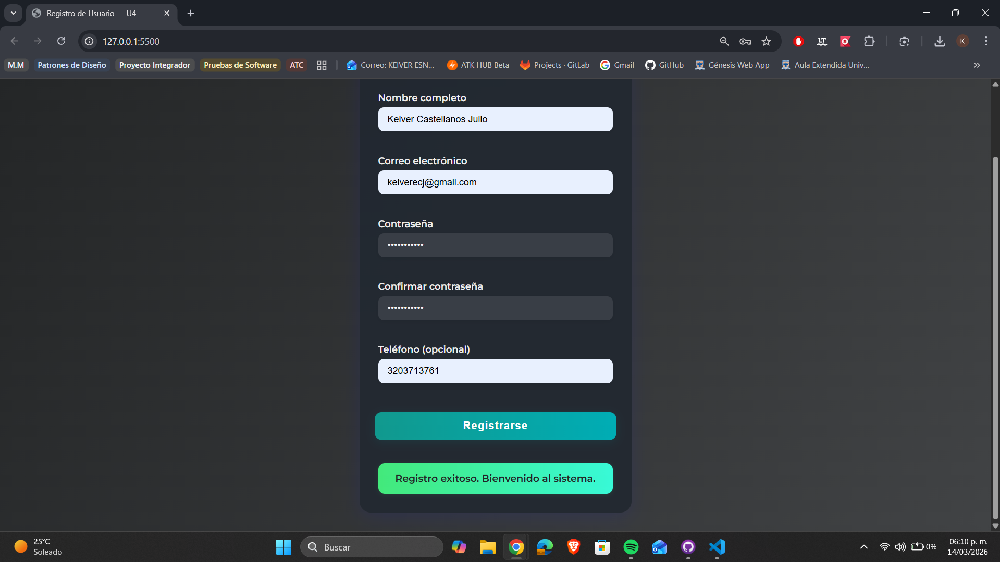
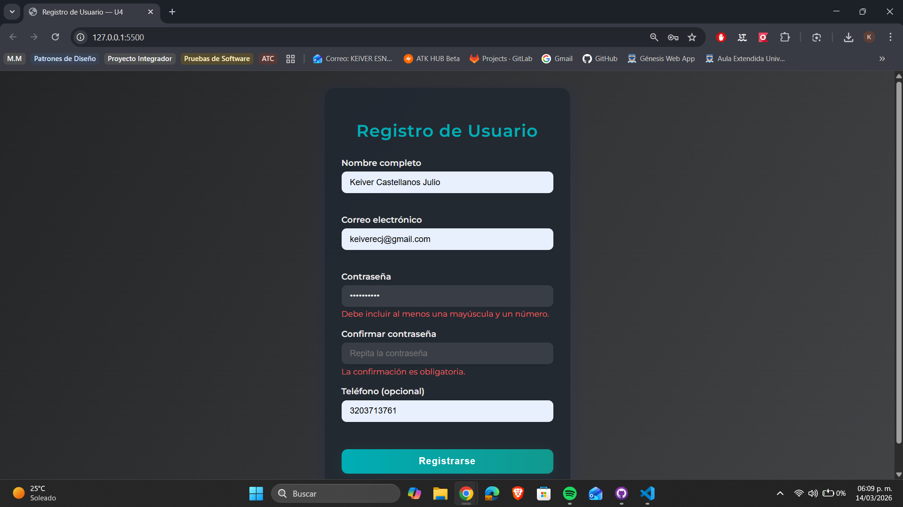

# castellanos-post2-u4

**Autor:** Keiver Esneid Castellanos Julio  
**Curso:** Programación Web — Unidad 4: JavaScript Básico  
**Programa:** Ingeniería de Sistemas  
**Universidad de Santander (UDES) · 2026**

---

## Descripción

Formulario de registro de usuario con validación completa del lado del cliente.
Combina validación manual con JavaScript y la Constraint Validation API nativa del
navegador. Muestra retroalimentación visual inmediata por campo, controla el evento
submit, aplica expresiones regulares para validar formatos y utiliza características
de ES6 en toda la implementación.

---

## Tecnologías utilizadas

- HTML5 (Constraint Validation API, atributos `required`, `minlength`, `pattern`)
- CSS3 (variables, animaciones, glassmorphism)
- JavaScript ES6 vanilla (arrow functions, template literals, destructuring)

---

## Estructura del proyecto

```
castellanos-post2-u4/
├── index.html       → Estructura del formulario con atributos de validación nativa
├── styles.css       → Estilos, estados válido/inválido y animaciones
└── validacion.js    → Lógica de validación, eventos blur/submit e indicador de fortaleza
```

---

## Instrucciones de ejecución

1. Clona el repositorio:
   ```bash
   git clone https://github.com/TU-USUARIO/castellanos-post2-u4.git
   ```
2. Abre la carpeta en **Visual Studio Code**.
3. Haz clic derecho sobre `index.html` → **Open with Live Server**.
4. La aplicación se abrirá automáticamente en Google Chrome.

---

## Funcionalidades implementadas

- ✅ **Checkpoint 1:** Validación al enviar — mensajes de error específicos por campo con borde rojo
- ✅ **Checkpoint 2:** Validación en tiempo real con evento `blur` — errores y correcciones inmediatas
- ✅ **Checkpoint 3:** Control del evento `submit` — mensaje de éxito y limpieza del formulario tras 2 s
- ✅ **Checkpoint 4:** Indicador de fortaleza de contraseña en tiempo real (Débil / Regular / Buena / Fuerte)

---

## Conceptos de JavaScript aplicados

- **Constraint Validation API:** `validity.valueMissing`, `validity.tooShort`, `validity.typeMismatch`, `validity.patternMismatch`
- **Manipulación del DOM:** `classList`, `textContent`, `focus()`
- **Eventos:** `addEventListener` con `blur`, `input` y `submit`; `e.preventDefault()`
- **ES6:** arrow functions, template literals, destructuring, `Array.every()`
- **Expresiones regulares:** validación de mayúsculas, dígitos y caracteres especiales

---

## Capturas de pantalla

### Checkpoint 1 — Errores al enviar sin llenar campos



### Checkpoint 2 — Validación en tiempo real con blur



### Checkpoint 3 — Mensaje de éxito al registrarse



### Checkpoint 4 — Indicador de fortaleza de contraseña


